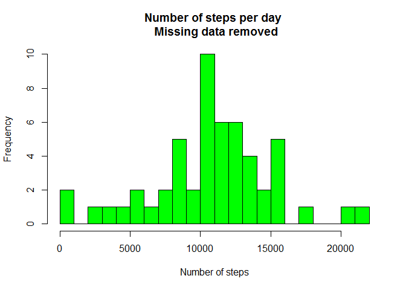
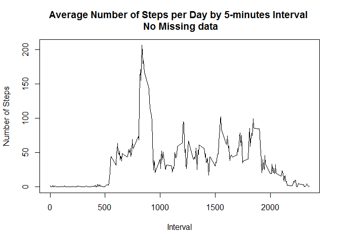
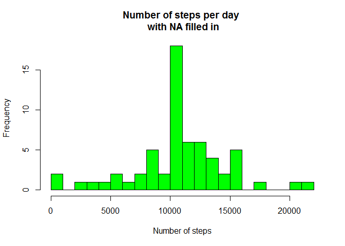
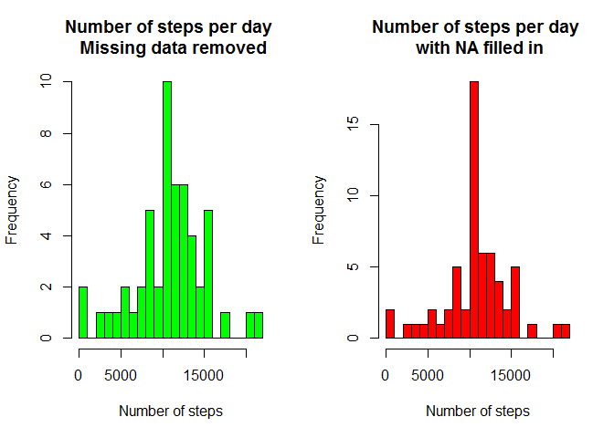
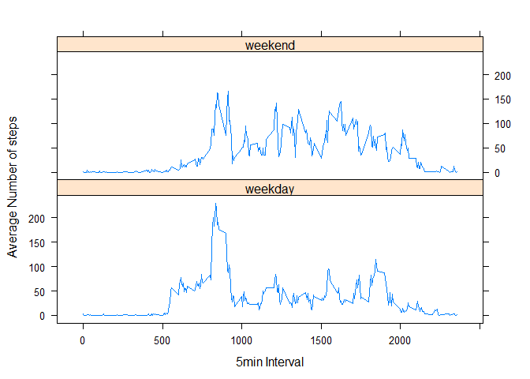

```r
library(lattice)
library("knitr")
```

## Loading and preprocessing the data

### 1. Load the data

```r
myData <- read.csv('activity.csv', header = TRUE, na.strings = "NA", stringsAsFactors=FALSE)
str(myData)
```

```
## 'data.frame':	17568 obs. of  3 variables:
##  $ steps   : int  NA NA NA NA NA NA NA NA NA NA ...
##  $ date    : chr  "2012-10-01" "2012-10-01" "2012-10-01" "2012-10-01" ...
##  $ interval: int  0 5 10 15 20 25 30 35 40 45 ...
```

```r
head(myData)
```

```
##   steps       date interval
## 1    NA 2012-10-01        0
## 2    NA 2012-10-01        5
## 3    NA 2012-10-01       10
## 4    NA 2012-10-01       15
## 5    NA 2012-10-01       20
## 6    NA 2012-10-01       25
```

```r
tail(myData)
```

```
##       steps       date interval
## 17563    NA 2012-11-30     2330
## 17564    NA 2012-11-30     2335
## 17565    NA 2012-11-30     2340
## 17566    NA 2012-11-30     2345
## 17567    NA 2012-11-30     2350
## 17568    NA 2012-11-30     2355
```

### 2. Process/transform the data (if necessary) into a format suitable for your analysis

```r
myData$date <- as.Date(myData$date, "%Y-%m-%d")
str(myData)
```

```
## 'data.frame':	17568 obs. of  3 variables:
##  $ steps   : int  NA NA NA NA NA NA NA NA NA NA ...
##  $ date    : Date, format: "2012-10-01" "2012-10-01" ...
##  $ interval: int  0 5 10 15 20 25 30 35 40 45 ...
```

```r
head(myData)
```

```
##   steps       date interval
## 1    NA 2012-10-01        0
## 2    NA 2012-10-01        5
## 3    NA 2012-10-01       10
## 4    NA 2012-10-01       15
## 5    NA 2012-10-01       20
## 6    NA 2012-10-01       25
```

## What is mean total number of steps taken per day?

### 1. Calculate the total number of steps taken per day

```r
stepPerDay <- aggregate(steps~date, data=myData, FUN = sum, na.rm=TRUE)
str(stepPerDay)
```

```
## 'data.frame':	53 obs. of  2 variables:
##  $ date : Date, format: "2012-10-02" "2012-10-03" ...
##  $ steps: int  126 11352 12116 13294 15420 11015 12811 9900 10304 17382 ...
```

```r
head(stepPerDay)
```

```
##         date steps
## 1 2012-10-02   126
## 2 2012-10-03 11352
## 3 2012-10-04 12116
## 4 2012-10-05 13294
## 5 2012-10-06 15420
## 6 2012-10-07 11015
```

### 2. If you do not understand the difference between a histogram and a barplot, research the difference between them. Make a histogram of the total number of steps taken each day

```r
hist(stepPerDay$steps, breaks = 30, main = "Number of steps per day \n Missing data removed", col = "green", xlab = "Number of steps")
```

<!-- -->

### 3. Calculate and report the mean and median of the total number of steps taken per day

```r
meanStepPerDay <- mean(stepPerDay$steps) 
medianStepPerDay <- median(stepPerDay$steps)
```

The `mean` is 1.0766189\times 10^{4}.
The `median` is 10765.


## What is the average daily activity pattern?
For this part of the assignment, you can ignore the missing values in the dataset.

1. Make a time series plot (i.e. type = "l") of the 5-minute interval (x-axis) and the average number of steps taken, averaged across all days (y-axis)
* Average number of steps over per day by 5-minutes interval

```r
avgStepPerInterval <- aggregate(steps~interval, data=myData, FUN=mean, na.rm=TRUE)
str(avgStepPerInterval)
```

```
## 'data.frame':	288 obs. of  2 variables:
##  $ interval: int  0 5 10 15 20 25 30 35 40 45 ...
##  $ steps   : num  1.717 0.3396 0.1321 0.1509 0.0755 ...
```

```r
plot(avgStepPerInterval$interval, avgStepPerInterval$steps, type = "l", xlab="Interval", ylab="Number of Steps", main="Average Number of Steps per Day by 5-minutes Interval \n No Missing data")
```

<!-- -->

2. Which 5-minute interval, on average across all the days in the dataset, contains the maximum number of steps

```r
maxInterval <- avgStepPerInterval[which.max( avgStepPerInterval$steps), 1]
```

The interval with the maximum number of step is the number 835


## Imputing missing values
Note that there are a number of days/intervals where there are missing values (coded as NA). The presence of missing days may introduce bias into some calculations or summaries of the data.

1. Calculate and report the total number of missing values in the dataset (i.e. the total number of rows with NAs)

```r
numberNA <- nrow(myData[which(is.na(myData$steps)),])
```
    
The number of rows with missing data is 'r numberNA`.

2. Devise a strategy for filling in all of the missing values in the dataset. The strategy does not need to be sophisticated. For example, you could use the mean/median for that day, or the mean for that 5-minute    

The strategy will be to replace missing values in the dataset with the average number of steps per day for that 5-minute interval. --> -->
    

3. Create a new dataset that is equal to the original dataset but with the missing data filled in.

```r
filledNaData <- transform(myData, steps= ifelse(is.na(myData$steps),       avgStepPerInterval[match(avgStepPerInterval$interval,   myData$interval), ]$steps, myData$steps))

sum(is.na(filledNaData))
```

```
## [1] 0
```

```r
str(filledNaData)
```

```
## 'data.frame':	17568 obs. of  3 variables:
##  $ steps   : num  1.717 0.3396 0.1321 0.1509 0.0755 ...
##  $ date    : Date, format: "2012-10-01" "2012-10-01" ...
##  $ interval: int  0 5 10 15 20 25 30 35 40 45 ...
```

```r
head(filledNaData)
```

```
##       steps       date interval
## 1 1.7169811 2012-10-01        0
## 2 0.3396226 2012-10-01        5
## 3 0.1320755 2012-10-01       10
## 4 0.1509434 2012-10-01       15
## 5 0.0754717 2012-10-01       20
## 6 2.0943396 2012-10-01       25
```

```r
# tail(newNaData)
```
    
4. Make a histogram of the total number of steps taken each day and Calculate and report the mean and median total number of steps taken per day. Do these values differ from the estimates from the first part of the assignment? What is the impact of imputing missing data on the estimates of the total daily number of steps?

```r
wFilledNaStepPerDay <- aggregate(steps~date, data=filledNaData, FUN = sum, na.rm=TRUE)
head(wFilledNaStepPerDay)
```

```
##         date    steps
## 1 2012-10-01 10766.19
## 2 2012-10-02   126.00
## 3 2012-10-03 11352.00
## 4 2012-10-04 12116.00
## 5 2012-10-05 13294.00
## 6 2012-10-06 15420.00
```

```r
sum(is.na(wFilledNaStepPerDay))
```

```
## [1] 0
```

```r
str(wFilledNaStepPerDay)
```

```
## 'data.frame':	61 obs. of  2 variables:
##  $ date : Date, format: "2012-10-01" "2012-10-02" ...
##  $ steps: num  10766 126 11352 12116 13294 ...
```

```r
head(wFilledNaStepPerDay)
```

```
##         date    steps
## 1 2012-10-01 10766.19
## 2 2012-10-02   126.00
## 3 2012-10-03 11352.00
## 4 2012-10-04 12116.00
## 5 2012-10-05 13294.00
## 6 2012-10-06 15420.00
```

```r
    hist(wFilledNaStepPerDay$steps, breaks = 30, main = "Number of steps per day \n with NA filled in", col = "green", xlab = "Number of steps")
```

<!-- -->

```r
    wFilledNaMeanStepPerDay = mean(wFilledNaStepPerDay$steps)
    wFilledNaMedianStepPerDay = median(wFilledNaStepPerDay$steps)
```

The new mean is 1.0766189\times 10^{4}.
The new median is 1.0766189\times 10^{4}.

Difference between the mean and the median when missing data are removed and when filled in.

```r
comparison <- data.frame("mean"=c(meanStepPerDay  -  wFilledNaMeanStepPerDay), "median"=c(medianStepPerDay- wFilledNaMedianStepPerDay))
rownames(comparison) <- c("Difference (naRemoved - naFilled)")
comparison
```

```
##                                   mean    median
## Difference (naRemoved - naFilled)    0 -1.188679
```

#Create Histogram to show difference. 

```r
par(mfrow=c(1, 2))
hist(stepPerDay$steps, breaks = 30, main = "Number of steps per day \n Missing data removed", col = "green", xlab = "Number of steps")
hist(wFilledNaStepPerDay$steps, breaks = 30, main = "Number of steps per day \n with NA filled in", col = "red", xlab = "Number of steps")
```

<!-- -->

```r
# legend("topright", c("NA removed", "Filled Na"), col=c("green", "red"), lwd=10)
```

## Are there differences in activity patterns between weekdays and weekends?

For this part the weekdays() function may be of some help here. Use the dataset with the filled-in missing values for this part.

    1. Create a new factor variable in the dataset with two levels – “weekday” and “weekend” indicating whether a given date is a weekday or weekend day.

```r
filledNaData$weekdays <- as.factor(ifelse(weekdays(filledNaData$date) %in% c("Saturday", "Sunday"),"weekend", "weekday"))

str(filledNaData)
```

```
## 'data.frame':	17568 obs. of  4 variables:
##  $ steps   : num  1.717 0.3396 0.1321 0.1509 0.0755 ...
##  $ date    : Date, format: "2012-10-01" "2012-10-01" ...
##  $ interval: int  0 5 10 15 20 25 30 35 40 45 ...
##  $ weekdays: Factor w/ 2 levels "weekday","weekend": 1 1 1 1 1 1 1 1 1 1 ...
```
    
    2. Make a panel plot containing a time series plot (i.e. type="l") of the 5-minute interval (x-axis) and the average number of steps taken, averaged across all weekday days or weekend days (y-axis). See the README file in the GitHub repository to see an example of what this plot should look like using simulated data.

```r
weekdAvgStepInterv<- aggregate(steps ~ weekdays + interval, data= filledNaData, FUN=mean, na.rm=TRUE)

library(lattice)
xyplot(steps ~ interval | weekdays, data=weekdAvgStepInterv, type="l", layout=c(1, 2), xlab="5min Interval", ylab="Average Number of steps")
```

<!-- -->
